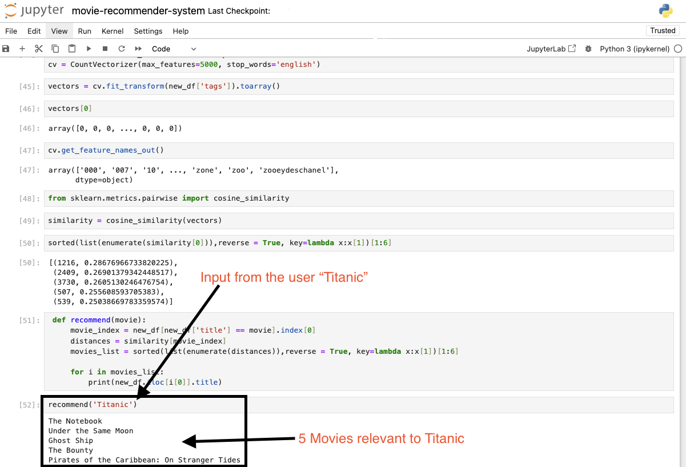

# Movie Recommendation System

This project is a movie recommendation system built with Python and Jupyter Notebook. It leverages collaborative filtering and content-based filtering techniques to suggest movies similar to the one entered by the user.

## Project Overview

### Importance of Recommender Systems

Recommender systems are crucial in today's digital age as they enhance user experience by suggesting relevant items, such as movies, books, products, and more. They play a vital role in various online fields, including e-commerce, streaming services, and social media platforms, by helping users discover content that matches their preferences and needs. This personalized approach not only increases user engagement but also drives sales and customer satisfaction.

### Dataset

The dataset used for this project is the TMDB 5000 dataset, which contains information about 5000 movies, including metadata such as genres, cast, crew, keywords, and more. Over the past few days, the dataset has undergone extensive data cleaning to ensure accuracy and consistency.

## Features

- Collaborative Filtering: Utilizes user-item interactions to recommend movies based on user preferences.
- Content-Based Filtering: Recommends movies by analyzing the content of movies and the preferences of the user.
- Data Cleaning: Ensures the dataset is free from inconsistencies and missing values.
- Vectorization: Uses vectorization techniques to convert textual data into numerical vectors, making it suitable for machine learning algorithms.

### Vectorization Techniques

In this project, I have used the following vectorization techniques:

1. **TF-IDF Vectorization**: Term Frequency-Inverse Document Frequency (TF-IDF) is used to convert textual data into numerical vectors. This technique helps in understanding the importance of a word in a document relative to a collection of documents.

2. **Cosine Similarity**: Once the textual data is vectorized, cosine similarity is used to measure the similarity between different movie descriptions. This helps in recommending movies that are similar to the ones a user has liked in the past.

## Example

Here’s a brief example of how the system works:

1. **Data Loading**: The system loads movie data from the TMDB 5000 dataset.
2. **Data Preprocessing**: It preprocesses the data to make it suitable for modeling, including handling missing values and normalizing text.
3. **Model Training**: It trains collaborative filtering and content-based filtering models using the preprocessed data.
4. **Recommendations**: When a user enters a movie, the system provides five similar movie recommendations leveraging the trained models.

### Future Work

The next step for this project is to link it with a website or application, allowing users to input a movie and receive recommendations through a user-friendly interface.

